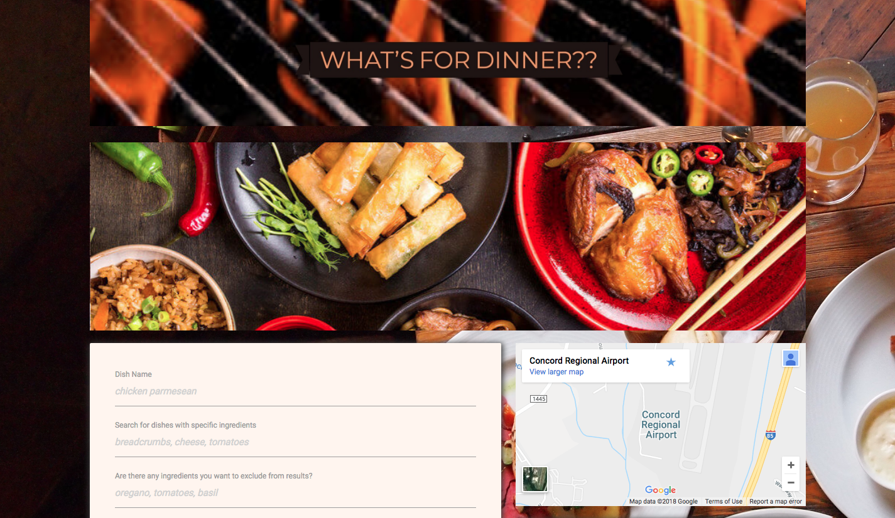

# What's for Dinner?

This app uses the Yummly API to search Yummly's recipe database and allows users to search and save dishes based on specified parameters.

### Contributors 
_Devin Dinapoli, Abby Olaleye, Andrew Knowles, Jeffrey Easley_

#

### Overview
* Our app uses the Yummly API to search their recipe database. 
* Search options are by dish, desired ingredients, and/or ingredients to exclude.  
* Advanced search options include cuisine, diet, and cooking time.
* After results are returned, there is an option to favorite recipes.  
* When the user favorites a recipe, a 'show favorites' button will appear.
* The Google Maps API is used to provide the user with nearby grocery stores where they can purchase the indgredients for their dish.

#

### Technical Components

* __Our app utilizes:__

  * Firebase as the database to store user searches and favorites.
  * Two APIs (Yummly and Google Maps)
  * AJAX to pull data
  * User input validation
  * Materialize as the CSS framework and for mobile responsiveness
  * Github Pages for deployment
  
#

### > __Click Below to Try it Out:__

